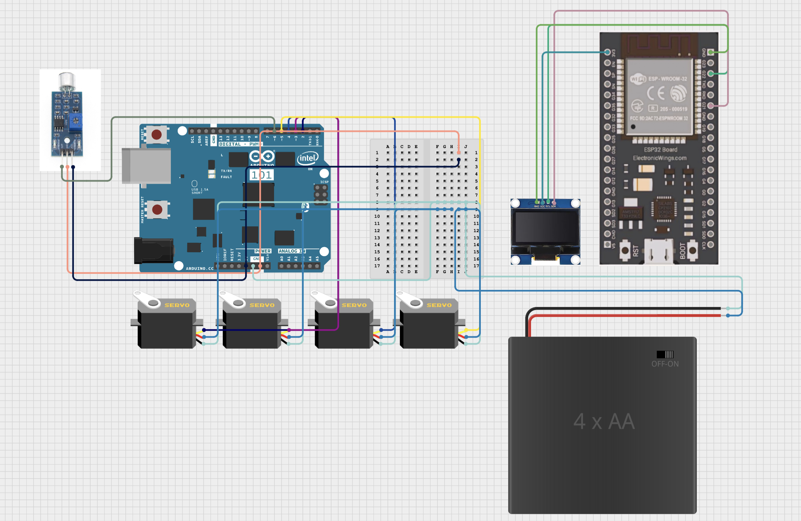
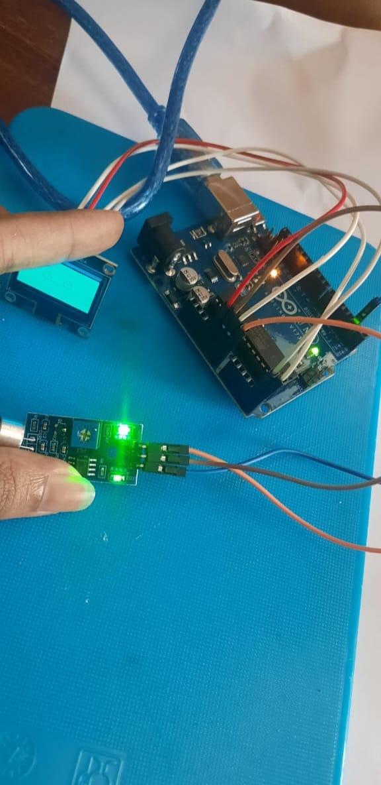
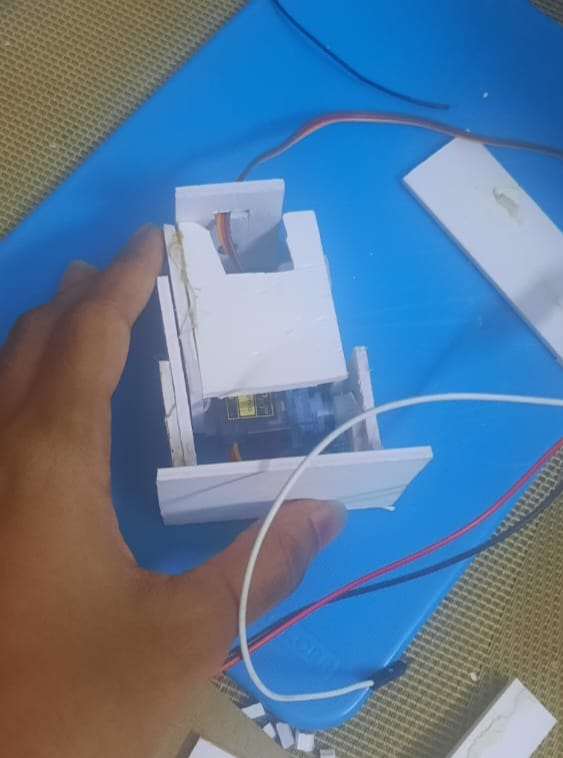
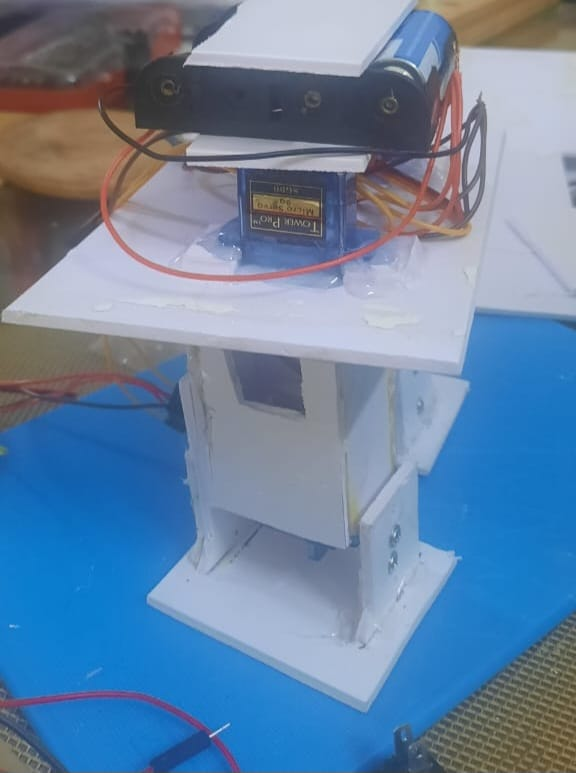
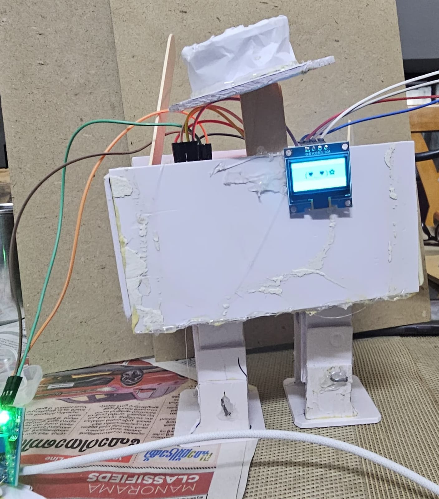

# Jacksu-chan- THe Moonwalking Robot 🎯

## Basic Details
### Team Name: Motu and Patlu

### Team Members
- Team Lead: Amrita Reji - CET
- Member 2: Meera R S - CET

### Project Description
Jacksu-chan is a cute little robot who is a huge MJ fan and would do nothing but moonwalk and even pull off a crusaito to any music, all with some cute expressions:))

### The Problem (that doesn't exist)
Imagine a world without our kawai jacksu chan! We were deeply concerened for a world without him to moonwalk and be cute. Hence we solved it right away hehe.

### The Solution (that nobody asked for)
We have solved it with Jacksu-chan, a robot who is expert in moonwalking and crusaitos!! Moonwalk? Check. Crusaitos? Double check. This robot’s got all the moves!Smooth moves, buttery grooves, and a sprinkle of kawaii — that’s Jacksu-chan for you!

## Technical Details
### Technologies/Components Used
For Software:
- Languages used - Arduino C++
- Frameworks used - Arduino IDE Environment
- Libraries used - AdaFruit_GFX(for OLED Display), Adafruit_SSD1306 (OLED driver library) ,Otto.h.
- Tools used - Arduino Uno, OLED Display, Digital Sound Sensor, Servo Motors, Batterie(power supply), Switch (for control),Esp32,solder,jumper wires,multimeter.

For Hardware:
- Main Components - Arduino Uno, OLED Display(1), Digital Sound Sensor(1), Servo Motors SG90s, Batteries (power supply)(4AA), Switch(1) (for control),esp32 to control oled.
- List specifications - Arduino Uno: 16 MHz, 5V microcontroller board, OLED Display: 128x64 pixels, I2C interface, Digital Sound Sensor: detects sound, digital output, Servo Motors: 5V, standard small servo, Batteries: power supply for the system, Switch: used to turn the device on/off,esp32 wroom.

# Schematic & Circuit

# Build Photos

  
  
  

In simple terms, a robot calls jacksu-chan who moonwalks their way to the moon.

### Project Demo
# Video

# Additional Demos
[Add any extra demo materials/links]

## Team Contributions
- Amrita Reji : Robot chasis, setting of servo motors, debugging
- Meera R S: OLED set up, debugging, sound sensor calibration 

---
Made with ❤️ at TinkerHub Useless Projects 

